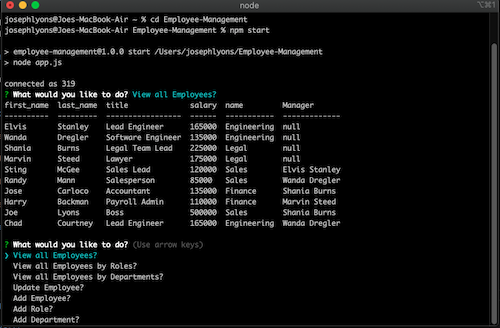
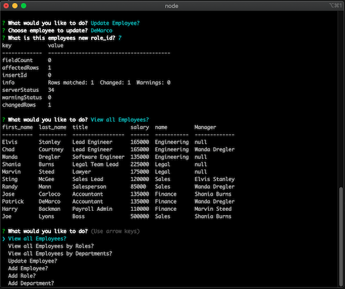

# Employee-Management

## Application Video Walkthrough

[Video Demo](https://drive.google.com/file/d/14ZUdXU-6HmOTkcdIVXivTv_ifhzB2NWi/view?usp=sharing)

## Table of Contents

* [Purpose](#Purpose)

* [Installation](#Installation)

* [Technologies](#Technologies)

* [Contact](#Contact)

* [License](#License)

## Purpose

A backend application that lets the user build, store and change their employees,departments and roles all while using the command line. `Console.table` is included to help the user visualize the database by building a easy to read table. 

## Installation

1. Run npm install to install all and any dependencies.
2. Run npm start in your command line to start the application. 
3. Navigate through the prompted questions with arrow keys and enter text fields simply with a keyboard. 

## Technologies

* ***Nodejs***
* ***Inquirer*** 
* ***MySQl2*** 
* ***Schema***
* ***Seed Files***
* ***JavaScipt***
* ***TablePlus***
* ***Console.Table***

## Contact

* [Email](mailto:josephjlyons90@gmail.com)
* [LinkedIn](www.linkedin.com/in/joseph-lyons-0a2630200/)

## License

Copyright (c) [2021] [Joseph Lyons]
Permission is hereby granted, free of charge, to any person obtaining a copy of this software and associated documentation files (the "Software"), to deal in the Software without restriction, including without limitation the rights to use, copy, modify, merge, publish, distribute, sublicense, and/or sell copies of the Software, and to permit persons to whom the Software is furnished to do so, subject to the following conditions:

The above copyright notice and this permission notice shall be included in all copies or substantial portions of the Software.

THE SOFTWARE IS PROVIDED "AS IS", WITHOUT WARRANTY OF ANY KIND, EXPRESS OR IMPLIED, INCLUDING BUT NOT LIMITED TO THE WARRANTIES OF MERCHANTABILITY, FITNESS FOR A PARTICULAR PURPOSE AND NONINFRINGEMENT. IN NO EVENT SHALL THE AUTHORS OR COPYRIGHT HOLDERS BE LIABLE FOR ANY CLAIM, DAMAGES OR OTHER LIABILITY, WHETHER IN AN ACTION OF CONTRACT, TORT OR OTHERWISE, ARISING FROM, OUT OF OR IN CONNECTION WITH THE SOFTWARE OR THE USE OR OTHER DEALINGS IN THE SOFTWARE.
